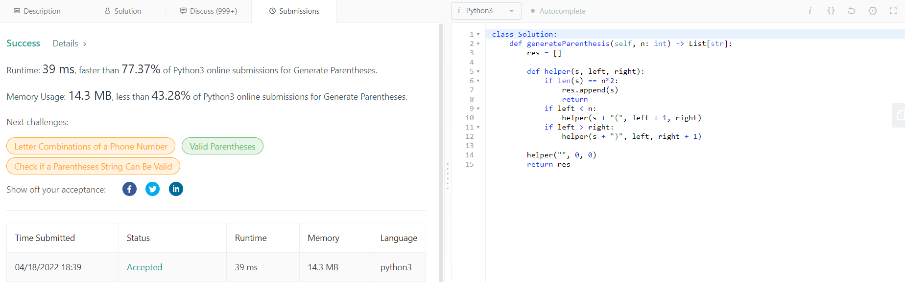

# PD_Dupla_18

**Número da Lista**: 5<br>
**Conteúdo da Disciplina**: PD - Programação Dinâmica<br>

## Alunos
|Matrícula | Aluno |
| -- | -- |
| 18/0100831  |  Gabriel Avelino |
| 18/0103431  |  João Victor Valadão |
## Sobre 
Nesse projeto de Programação dinâmica, iremos resolver questões de Online Judges (Juízes onlines) usando Programação Dinâmica, o site escolhido para esses questões são do <a>LeetCode</a>. Para encontrar as questões usamos tags de PD:  

- Questão 1 - https://leetcode.com/problems/jump-game/
- Questão 2 - https://leetcode.com/problems/generate-parentheses/
- Questâo 3 - https://leetcode.com/problems/climbing-stairs/

## Apresentação

Link do vídeo da apresentação:

[](https://www.youtube.com/watch?v=5FcrQDsx8-I) 

## Screenshots

<center>


<figcaption>Figura 1: Accepted Questão 1</figcaption>

</br>


<figcaption>Figura 2: Accepted Questão 2</figcaption>

</br>


<figcaption>Figura 3: Accepted Questão 3</figcaption>

</br> 

</center>

## Instalação 
**Linguagem**: Python/Java<br>
**Framework**: não existe<br>
Possuir Python e Java instalado.

## Uso 
Execute a questão 1 com os seguintes comandos:
```jsx
Navegue até o diretório que o arquivo se encontra
javac .\Solution.java
java Solution
```
Execute a questão 2 com os seguintes comandos:
```jsx
Navegue até o diretório que o arquivo se encontra
python ou python3 Solution.py
```
Execute a questão 3 com os seguintes comandos:
```jsx
Navegue até o diretório que o arquivo se encontra
python ou python3 Solution.py
```
